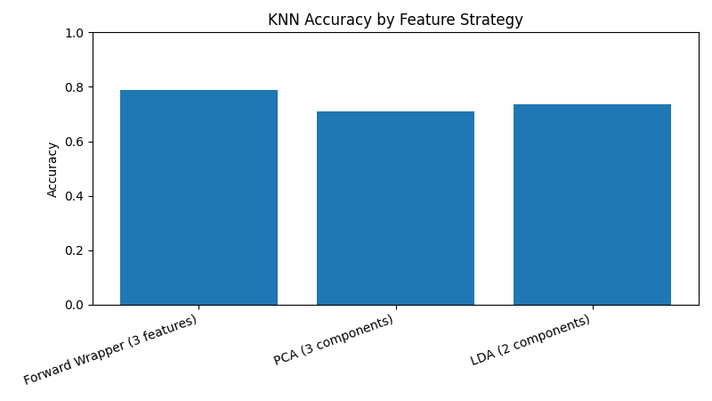
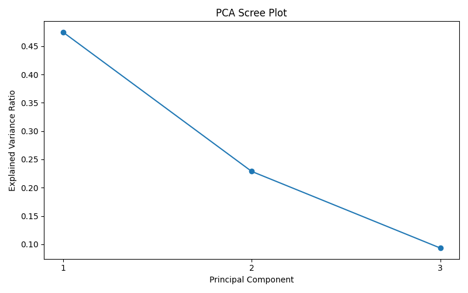
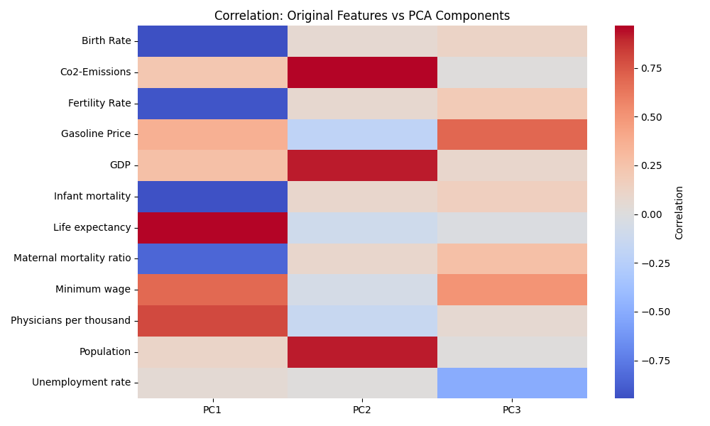

# devstatus-dimred-benchmark

Modern benchmark of feature selection vs dimensionality reduction for classifying country development status using KNN (K=9). Includes reusable modules, visuals, and exportable results.

## Highlights
- Modular pipeline with clean preprocessing and evaluation
- Forward Wrapper feature selection (manual implementation)
- PCA and LDA projections with visual diagnostics
- Auto-generated benchmark charts and CSV results

## Quick Start
```bash
pip install -r requirements.txt
python src/main.py
```

## Visuals
Run the pipeline to generate graphs in `results/`.





## Problem Statement
Given numeric country-level features, predict `development_status` (Developed vs Developing) and quantify how feature selection or dimensionality reduction affects accuracy.

## Methodology
- Mean imputation, label encoding, standardization
- 80/20 train-test split with `random_state=42`
- KNN (K=9) trained on:
  - Forward Wrapper selected features (3 features)
  - PCA components (3 components)
  - LDA components (up to 2 components, bounded by number of classes)

## Techniques
### Forward Wrapper
Greedy feature selection that adds the best-performing feature at each step based on validation accuracy.

### PCA
Unsupervised linear projection to preserve maximum variance using 3 components.

### LDA
Supervised projection to maximize class separation using up to 2 components.

## Results (Auto-Generated)
Results are written to `results/accuracy_results.csv` and summarized in `results/accuracy_benchmark.png`.

| Method | Accuracy |
| --- | --- |
| Forward Wrapper (3 features) | Generated at runtime |
| PCA (3 components) | Generated at runtime |
| LDA (components depend on classes) | Generated at runtime |

## Key Observations
- Forward Wrapper yields interpretable, compact feature subsets.
- PCA captures variance but is label-agnostic.
- LDA often excels when class separation aligns with linear boundaries.

## Repository Structure
```
devstatus-dimred-benchmark/
├── data/
│   └── world_data.csv
├── notebooks/
│   └── exploratory_analysis.ipynb
├── results/
│   └── accuracy_results.csv
├── src/
│   ├── preprocessing.py
│   ├── forward_wrapper.py
│   ├── pca_analysis.py
│   ├── lda_analysis.py
│   ├── knn_evaluation.py
│   └── main.py
├── requirements.txt
├── README.md
└── report.md
```

## Notes
- Run `python src/main.py` to regenerate graphs and CSVs.
- See `notebooks/exploratory_analysis.ipynb` for visual EDA and projections.
